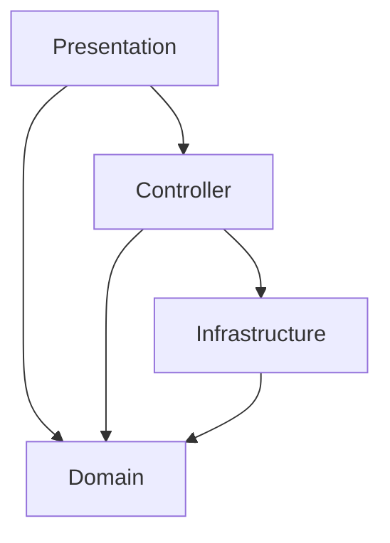

# Company Creation Project (Onion Architecture)

This is a WPF application for managing Companies, Users, and Accounts, built using the **Onion Architecture** pattern to ensure modularity and maintainability. It uses **Entity Framework 6 (EF6)** with a Code-First (Fluent API) approach for data access.

## Getting Started

Follow these steps to set up the project locally.

### Prerequisites
- **Visual Studio 2022** (with .NET Desktop Development workload)
- **.NET Framework 4.8**
- **SQL Server Express** (or any SQL Server instance)
- **Git**

### 1. Clone the Repository
Open your terminal or command prompt and run:
```powershell
git clone https://github.com/krishsharma-busy/CompanyCreation-Project.git
cd CompanyCreation-Project
```

### 2. Database Setup
1. Open **SQL Server Management Studio (SSMS)**.
2. Connect to your SQL Server instance.
3. Run a script to create the `COMPANYPROJECT` database and required tables (`Company`, `User`, `Account`).

### 3. Configure Connection String
1. Open the solution `CompanyProject.slnx` in Visual Studio.
2. Open `Presentation/App.config`.
3. Update the `connectionString` to match your local SQL Server instance:
   ```xml
   <connectionStrings>
     <add name="CompanyDB" 
          connectionString="Data Source=YOUR_SERVER_NAME;Initial Catalog=COMPANYPROJECT;Integrated Security=True;" 
          providerName="System.Data.SqlClient" />
   </connectionStrings>
   ```
   *(Replace `YOUR_SERVER_NAME` with your actual server name, e.g., `.\SQLEXPRESS` or `(localdb)\MSSQLLocalDB`)*.

### 4. Build and Run
1. In Visual Studio, right-click the **Presentation** project in Solution Explorer and select **Set as Startup Project**.
2. Press **Ctrl+Shift+B** to build the solution (this will restore NuGet packages).
3. Press **F5** to run the application.

---

# Project Architecture

This WPF application follows the **Onion Architecture** pattern to ensure modularity, scalability, and loose coupling.

## High-Level Overview

The application is divided into 4 main layers/projects. Dependencies flow **inward** towards the Domain layer. `Domain` is the core and depends on nothing.



---

## 1. Domain Layer (Core)
**Function:** Contains the core business logic and data structures. It has **zero dependencies** on other layers or frameworks.

- **Entities:** Pure C# classes (POCOs) representing database tables.
  - `CompanyEntity`, `UserEntity`, `AccountEntity`
  - Initialize all string properties to empty strings `""` to prevent nulls.
- **DTOs (Data Transfer Objects):** Plain objects for passing data between layers.
  - `CompanyDTO`, `UserDTO`, `AccountDTO`
- **Interfaces:** Contracts for Repositories.
  - `ICompanyRepository`, `IUserRepository`, `IAccountRepository`
- **GlobalVar:** Global constants/state (`CompanyId`, `UserId`).

---

## 2. Infrastructure Layer (Data Access)
**Function:** Handles all interactions with the database. Implements the Repository interfaces defined in Domain using **Entity Framework 6 (EF6)**.

- **AppDbContext:** Central EF6 context, mapping entities to SQL tables.
- **Configurations:** Fluent API classes (`CompanyConfiguration`, etc.) that map Entity properties to DB columns.
- **Repositories:** Implementations of Domain interfaces.
  - `CompanyRepository`: Uses `AppDbContext` to query/save `CompanyEntity`.
  - `UserRepository`, `AccountRepository`.

---

## 3. Controller Layer (Application Logic)
**Function:** Acts as the "brain". Orchestrates data flow between UI and Data Access. It never exposes Entities to the UI, only DTOs.

- **Services:** Contains business logic.
  - `CompanyService`
  - `UserService`
  - `AccountService`
- **Mappers:** Helper classes to convert `DTO ↔ Entity`.
  - `CompanyMapper`, `UserMapper`, `AccountMapper`.

**Flow:**
1. Receives DTO from Presentation.
2. Validates/processes data.
3. Converts DTO to Entity via Mapper.
4. Calls Repository to save Entity.

---

## 4. Presentation Layer (UI)
**Function:** The WPF frontend. Handles user interaction and rigorous input validation.

- **Views (XAML):** The UI layout.
  - `CreateCompanyView`, `LoginView`, `DashboardView`, etc.
- **ViewModels:** MVVM logic.
  - `CreateCompanyViewModel`: Validates input (GSTIN format, required fields), creates DTO, calls Service.
- **GlobalStyles:** Centralized styles for consistent look (Light Theme).

---

## Data Flow Example: Creating a Company

1. **User** enters data in `CreateCompanyView`.
2. **ViewModel** validates (e.g., checks GSTIN length).
3. **ViewModel** creates `CompanyDTO` and calls `CompanyService.Save(dto)`.
4. **Service** calls `CompanyMapper.ToEntity(dto)` → returns `CompanyEntity`.
5. **Service** calls `CompanyRepository.Add(entity)`.
6. **Repository** uses `AppDbContext` to `INSERT` into SQL Server.

---

## Key Design Decisions

- **EF6 with Fluent API:** We moved away from Data Annotations on Entities to keep the Domain pure. Mappings are now in `Infrastructure/Configuration`.
- **Null Handling:** All string properties in Entities and DTOs default to `""`.
- **Validation:** 
  - **UI (ViewModel):** Input format (regex, length), required fields.
  - **Service:** Business rules (uniqueness checks).
- **Global Styles:** Defined in `Styles/GlobalStyles.xaml` for consistency.
